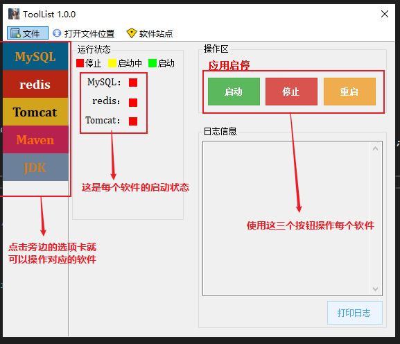
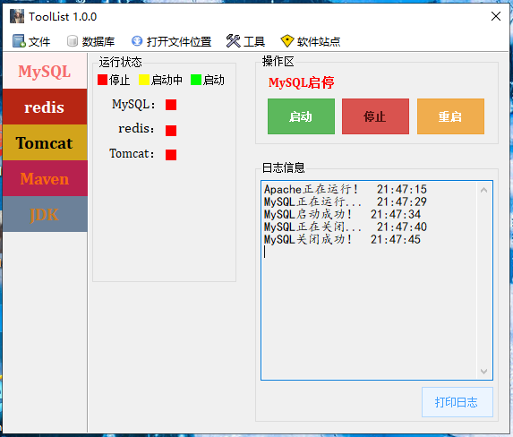

# 软件介绍

该款软件是为了方便Java程序员平时开发而开发的，作为程序员，可能需要经常更换电脑或者重装系统，但是随之而来的问题也很明显，在装完系统跟愉快的写代码之间还有一个凶猛的拦路虎——安装开发环境。而这就是我们比较头痛的地方，而且由于不是经常安装，有的时候难免会忘记安装细节，这时候又需要去google，非常的浪费时间，而这款软件就是专门为了开发而生的，它集合了开发中常用的软件于一身，也就是只需要装上这一个软件，就免去了安装MySQL，redis，Tomcat，Maven，JDK等这些软件，是一个“巨大”的绿色安装包！！！

# 软件演示

界面很简单，操作也很简单。

# 下载

安装包已经上传到坚果云：https://www.jianguoyun.com/p/DRjA8TkQ5o38BxifqLYC

手动分割线  &&&&&&&&&&&&&&&&&&&&&&&&&&&&&&&&&&&&&&&&&&&&&&&&&&&&&&&&&&&&

&&&&&&&&&&&&&&&&&&&&&&&&&&&&&&&&&&&&&&&&&&&&&&&&&&&&&&&&&&&&&&&&&&&&&

# 1.1.0版本

新的界面：

这个版本主要增加了对数据库操作的支持，点击菜单栏的数据库栏，目前支持了对mysql跟redis的操作

全都是以web端的形式操作的，使用了adminer操作mysql数据库，adminer是一个小型的用php写的操作mysql的工具，具体网址：<https://www.adminer.org/>

打开后会跳转到一个网页，输入mysql的账户跟密码登录即可：

操作redis的工具是我自己写的，源码地址：<https://github.com/Traeric/ToolsManageRedis>

打开后同样会跳转到一个网页，数据要进入的数据库号码即可（0-15）

新的软件安装包已经上传，地址：https://www.jianguoyun.com/p/DT4h73EQ5o38Bxjln70C

